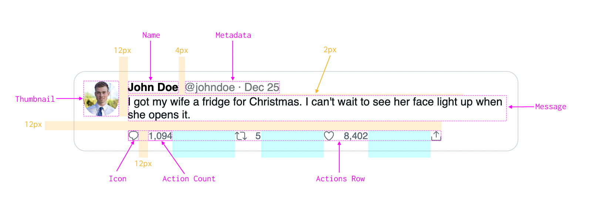

Follow the given specifications as closely as you can. An example thumbnail and icon SVGs are provided to you in the template.

Requirements

- Tweet
	- Background color: #fff
	- Border color: #cfd9de
	- Border width: 1px
	- Border radius: 16px
	- Padding: 12px
- Thumbnail
	- Size: 48px
	- Fully rounded
- Name
	- Color: #000
	- Font family: sans-serif
	- Font size: 15px
	- Font weight: bold
- Metadata
	- Color: #71767b
	- Font family: sans-serif
	- Font size: 15px
	- Use &middot; for the dot
- Message
	- Color: #0f1419
	- Font family: sans-serif
	- Font size: 15px
- Actions Row
	- Max width: 425px
	- Equal spacing between each action
- Icon
	- Color: #536471
	- Size: 16px
	- Vertically centered with the count
- Action Count
	- Color: #536471
	- Font size: 13px

Test cases

- Variable text length:
	- Tweets with just a few characters.
	- Tweets which don't exceed a single line.
	- Super long author names and handles. This will take some work to handle, so it is ok not to handle this for now.
- Resize the browser to test rendering on various widths:
	- Narrow width: Renders fine on narrow widths up to 300px.
	- Wide widths: The action row respects the max width and does not stretch across the entire row.
  
